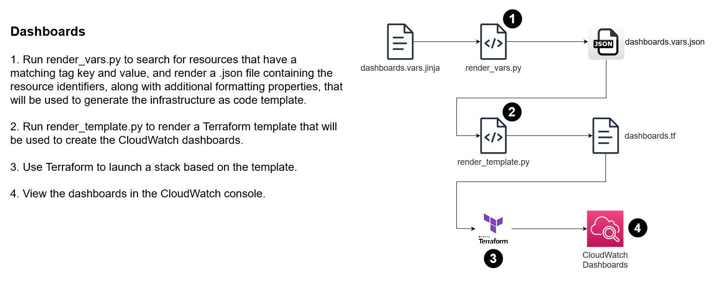

# How to create CloudWatch dashboards using Jinja templates
This project demonstrates how to discover create dynamic, custom CloudWatch dashboards by using Jinja templates to render the dashboard body. The example creates CloudWatch dashboards for three support tiers - resource, service, and system - to monitor performance of Amazon Elastic File System volumes. Note that the dashboards specify line colors based on a color blind safe palette.

## How it works


## Prerequisites
* Terraform - I recommend installing using [TFSwitch](https://tfswitch.warrensbox.com/)
* [Python3](https://www.python.org/downloads/)
* [Jinja2](https://jinja.palletsprojects.com/en/3.1.x/intro/#installation)

## Deploy
* Note that this deployment is storing state in the local `terraform.tfstate` file rather than in a remote backend - so, be sure to NOT delete this file until after the stack has been properly destroyed. 
* Deploy the initial infrastructure that will be used as example resources for the CloudWatch dashboards.
```bash
cd examples/complete
terraform init
terraform apply
```
* Create a virtual environment to run the Python scripts.
```bash
python3 -m venv .venv
source .venv/bin/activate
python3 -m pip install boto3 jinja2
```
* Render the vars input file.
```bash
cd ../..
python3 scripts/render_vars.py --tag-key Application --tag-value cw-dash --template dashboards.vars.jinja --rendered-file examples/complete/dashboards.vars.json
```
* Render the Terraform template.
```bash
python3 scripts/render_template.py --template dashboards.tf.jinja --template-vars examples/complete/dashboards.vars.json --rendered-file examples/complete/dashboards.tf
```
* Add the dashboards to the stack.
```bash
cd examples/complete
terraform apply
```
* Use Session Manager to connect to the test-controller instance and run some performance tests on the file systems. This example uses [fio](https://fio.readthedocs.io/en/latest/index.html); modify the parameters however you like.
```bash
sudo su ec2-user
sudo yum install fio -y
fio --name=random-read-write --directory=/mnt/efs1:/mnt/efs2 --rw=randrw --bsrange=100k-1M,1M-4M --size=4G --numjobs=16 --end_fsync=1
```
* Navigate to CloudWatch Dashboards and verify the `cw-dash-demo` tier 1, 2, and 3 dashboards are working.

## Destroy
* Destroy the stack to avoid additional costs.
```bash
cd examples/complete
terraform destroy
```
